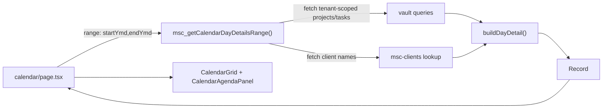

# Phase 9.2: Server Aggregation (Repo-Aligned)

## Objective
Shift day-detail computation from client-side orchestration to a server-side aggregation layer, without breaking current add/edit/delete task interactions.

## Architecture Decision
- Add the new aggregation action in [`d:\Cursor_Projectz\MSC-Projectz\lib\msc_vault_server_actions.ts`](d:\Cursor_Projectz\MSC-Projectz\lib\msc_vault_server_actions.ts) (consistent with existing vault auth/read patterns), not a new `app/actions` surface.
- Keep [`d:\Cursor_Projectz\MSC-Projectz\lib\msc_calendar_utils.ts`](d:\Cursor_Projectz\MSC-Projectz\lib\msc_calendar_utils.ts) as the single source of truth for `DayDetail` shaping (`buildDayDetail`).
- Return a serializable payload (`Record<string, DayDetail>`), not `Map`.

## Data Flow (Target)

## Implementation Steps
1. **Create server aggregation action (read model)**
   - Add `msc_getCalendarDayDetailsRange({ startYmd, endYmd, includeDone })` in [`d:\Cursor_Projectz\MSC-Projectz\lib\msc_vault_server_actions.ts`](d:\Cursor_Projectz\MSC-Projectz\lib\msc_vault_server_actions.ts).
   - Reuse existing tenant/auth context resolution used by current vault read actions.
   - Query projects/tasks once for the requested range scope.
   - Build `clientsById` map once from `msc-clients`.
   - Use `buildDayDetail` from [`d:\Cursor_Projectz\MSC-Projectz\lib\msc_calendar_utils.ts`](d:\Cursor_Projectz\MSC-Projectz\lib\msc_calendar_utils.ts) for each day key.
   - Return `{ byDay: Record<string, DayDetail> }`.

2. **Refactor calendar page read path only**
   - In [`d:\Cursor_Projectz\MSC-Projectz\app\(main)\(command-center)\calendar\page.tsx`](d:\Cursor_Projectz\MSC-Projectz\app\(main)\(command-center)\calendar\page.tsx), use the new action as the primary source for `selectedDayDetail` and `resolveDayDetail`.
   - Keep existing store hydration and mutation flows (add/edit/delete) intact in this phase.
   - Add a minimal error fallback path to current local detail build if aggregation response fails.

3. **Range scoping for performance**
   - Month view: request only visible calendar grid range.
   - Week view: request only current week range.
   - Avoid fetching full history/future on each navigation.

4. **Parity and behavior verification**
   - Ensure parity with current UI expectations:
     - client grouping
     - group counts
     - unassigned bucket
     - sort determinism
     - empty states
   - Confirm task chip edit behavior and client-jump interactions remain unchanged.

## Guardrails
- No schema changes.
- No new dependencies.
- Keep `DayDetail` and `DayDetailGroup` contract unchanged for consumers.
- Keep server response serializable (no `Map` in transport).

## Acceptance Criteria
- Calendar renders identical grouped day-detail UI from server data.
- Route changes (month/week/date navigation) fetch bounded range data only.
- Add/edit/delete task still updates calendar surfaces correctly (via refresh/recompute path).
- Build + local smoke pass for `/` and `/calendar`.

## Optional Follow-up (Phase 9.2b)
- Introduce targeted refresh of only affected day keys after task mutations.
- Add lightweight dev timing logs to compare client vs server aggregation cost.
