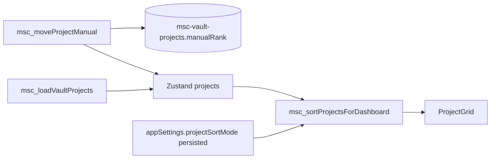

# Sort / Move hybrid (manual rank + sort modes)

## Product scope

- **Persistence:** A single **integer** on each vault project, e.g. `manualRank` (name can match code). Lower value = **earlier** in the list when mode is **Manual** (convention: sort ascending, tie-break **`createdAt`**, then **`id`**, for stability).
- **Sort modes (view preference, not stored on project):** `manual` | `name` | `updated` | `status` — live in [`lib/types.ts`](lib/types.ts) `AppSettings` (e.g. `projectSortMode`) and the existing Zustand [`lib/store.ts`](lib/store.ts) `persist` path next to `projectViewMode`.
- **Tier-2 UI:** **Move up / Move down** only when `projectSortMode === 'manual'`, and only for projects the current user **owns** (see **Permissions** below and server `msc_assertOwnedVaultProject` in [`lib/msc_vault_server_actions.ts`](lib/msc_vault_server_actions.ts)). **Desktop:** show **up/down chevrons** on **card hover** (keeps grid clean). **Mobile / small viewports:** use an **ellipsis (⋯) menu** with “Move up” / “Move down” (same actions, no hover affordance). If `projectSortMode !== 'manual'`, **hide all Move UI** (not only disabled).

**Caveat (document in roadmap / code comment):** `manualRank` is **on the project row** — **shared** for all viewers (owner + members). **Only the owner** can change it. Members see order resulting from the owner’s manual ranks; they cannot edit.

## Optimistic sync and Zustand rollback

**Default recommendation (MVP, lowest risk):** **Pessimistic (no optimistic reorder).**

- On Move click: set a **per-project or global `moveInFlight`** flag (or disable the pair of buttons) so the user cannot double-submit.
- `await msc_moveProjectManual(...)`.
- On **success:** refresh truth from the server by **`hydrateVaultFromPayload()`** (same as other vault mutations) **or** merge the server-returned `Project` slice if the action returns updated docs. Order then **always** matches the database.
- On **failure:** **no** client order change was applied, so **nothing to roll back**; show a short error (toast or inline message) and keep the current `projects` state.

**Optional follow-up (snappier UX):** **Optimistic** reorder:

1. `const previous = get().projects` (or `structuredClone` the array to avoid reference bugs).
2. Apply the **same** neighbor-swap as the server would do to `projects` in the store.
3. `try { await msc_moveProjectManual(...) } catch { set({ projects: previous }); toast error }`
4. On **success,** still run **hydrate** (or server response merge) to **reconcile** any server-side normalization; if that’s too heavy, replace optimistic patch with the returned projects only.

**Rule:** Never leave the UI in a reordered state without **either** successful server response **or** **rollback to `previous`**. Prefer pessimistic for v1 unless you explicitly add optimistic with snapshot restore.

## Rank collision (ties on `manualRank`)

**Sorting (read path) — always:**

- In [`lib/msc_project_sort.ts`](lib/msc_project_sort.ts) (or equivalent), for mode **manual** use: **`manualRank` ascending**, then **deterministic tie-breaker `createdAt` ascending** (or `id` as final tie-breaker if `createdAt` is identical). This fixes display when many rows are still `0` or duplicates exist.

**No mandatory server “normalization pass” for v1** if the sort helper is consistent everywhere (dashboard list, and the same ordering logic inside `msc_moveProjectManual` when resolving “neighbor” to swap with).

**Write path (move):** Build the list of **visible/owner-allowed** projects using the **same** comparator as `msc_sortProjectsForDashboard` (including tie-breakers), find the index of the moved project, swap with the neighbor, then **exchange `manualRank` field values** between the two Payload documents (or assign explicit new integers if you prefer a **micro-renumber** of only those two to break ties, e.g. if both were `0` — the server can set them to `n` and `n+1` for the two docs only). The important part: **neighbor resolution = same order the user sees** (tie-broken), so the swap matches expectations.

**Optional v2:** Admin script to **normalize** all ranks to `10, 20, 30…` to reduce future collisions — not required to ship.

## Permissions: Move Up/Down only for owner (members never see controls)

- **UI gate (strict):** In [`components/MSC-Projectz-ProjectCard.tsx`](components/MSC-Projectz-ProjectCard.tsx) and the list item in [`components/project-grid.tsx`](components/project-grid.tsx) (`ProjectListItem`), **do not render** the Move up/down (or overflow) controls unless **all** of:
  - `appSettings.projectSortMode === 'manual'`
  - `user?.payloadUserId != null`
  - `String(project.ownerUserId) === String(user.payloadUserId)`  
  (Use a tiny helper, e.g. `msc_isVaultProjectOwner(project, user)`, in `lib/` to avoid copy-paste and keep one source of truth.)
- This matches the **server** behavior (`msc_assertOwnedVaultProject` — **owner** only, not “member” of someone else’s project). **Admins** who are **not** the `user` on the project row also **do not** get move buttons; if product later needs **admin** reorder, that would be a **separate** `access` + UI rule change.

**Members:** With the above check, **members never see** Move controls (they are not the owner; `ownerUserId` is the project’s owner field).

**Server still enforces** owner-only; the UI is defense-in-depth and avoids confusing affordances.

## Data and Payload

1. **Collection field** in [`collections/MSC-Projectz-VaultProjects.ts`](collections/MSC-Projectz-VaultProjects.ts): add `manualRank` (`number`, required, `defaultValue: 0` or a safe default, `min: 0` optional). Expose in `admin.defaultColumns` if you want it visible in Payload (optional).
2. **Migrations / backfill:** After Payload/SQLite picks up the new column, **existing** rows may all be `0`. **No one-time script is mandatory** if the client always sorts with **secondary key** `createdAt` / `id` when `manualRank` ties. For nicer spacing later, a **small optional** `jiti` script (similar to other `scripts/msc_*.mjs` patterns) can renumber by `createdAt` — only if you want monotonic ranks out of the gate.
3. **Map layer:** Extend `MscVaultProjectDoc` and `msc_mapProjectDoc` in [`lib/msc_map_vault.ts`](lib/msc_map_vault.ts); add `manualRank: number` to the client [`Project`](lib/types.ts) interface.
4. **Create path:** In `msc_createVaultProject` ([`lib/msc_vault_server_actions.ts`](lib/msc_vault_server_actions.ts)), set initial `manualRank` to **max + 1** (or a gap strategy) over **this owner’s** projects to append new projects at the end in manual mode.
5. **Update path:** In `msc_updateVaultProject` `data` assembly, if `updates.manualRank !== undefined`, set `data.manualRank` (and ensure `Project` / store typings allow a partial update).

**Reorder implementation (recommended):** Add a **dedicated** server action, e.g. `msc_moveProjectManual(projectId, 'up' | 'down')`, that:

- Asserts the project is **owned** by the session user (reuse `msc_assertOwnedVaultProject`).
- Resolves **neighbors** using the **same** sort order as the client **manual** mode (including **tie-breakers**).
- **Swap `manualRank` between the two projects** (target and neighbor) via `payload.update`. **“Atomic” in practice:** Payload/SQLite here will be **two sequential updates**; true DB-level atomicity may not be exposed. Mitigation: perform update A, then B; if B fails, **attempt to revert A** to the original rank or call **`hydrateVaultFromPayload`** to resync. On success, **hydrate** is still the simplest way to guarantee client == server.
- Handles the **equal-rank** edge with a two-row micro-assign if a pure exchange would be a no-op (see **Rank collision**).

- Returns updated projects or rely on **hydrate** on success (see **Optimistic sync** above).

## Client: sort pipeline and UI

1. **State:** `projectSortMode` in `AppSettings` + `setProjectSortMode` in [`lib/store.ts`](lib/store.ts) (mirrors `setProjectViewMode`).
2. **Single place to sort:** `msc_sortProjectsForDashboard` in e.g. [`lib/msc_project_sort.ts`](lib/msc_project_sort.ts) with rules in **Rank collision** above, plus:
   - `name`: locale-aware `name` compare.
   - `updated`: `updatedAt` desc (newest first) or asc — **pick one** and keep consistent with label in UI.
   - `status`: e.g. `local` then `live`, then `name` (or reverse — document the rule).
3. **Wire into dashboard:** In [`components/MSC-Projectz-DashboardRouteView.tsx`](components/MSC-Projectz-DashboardRouteView.tsx) (or where `filteredProjects` is built from `searchQuery`), **filter first**, then **sort** the array passed to `ProjectGrid`. **Suggest** dashboard-only for v1 for dropdowns unless a shared hook is easy.
4. **Sort control:** A **Sort** `Select` or dropdown next to the **grid/list** control in [`components/dashboard-layout.tsx`](components/dashboard-layout.tsx) (only when `pathname === '/dashboard'`, like search).
5. **Move up/down:** In [`components/MSC-Projectz-ProjectCard.tsx`](components/MSC-Projectz-ProjectCard.tsx) and list row in [`components/project-grid.tsx`](components/project-grid.tsx) — see **Permissions**; **typed** to [`Project`](lib/types.ts) and `AppSettings` / `User` as today. **Desktop:** chevrons on **hover**; **mobile:** ellipsis menu; wire to `msc_moveProjectManual` + error handling; prefer **pessimistic** + hydrate for v1. **List view** may use the same pattern (hover where applicable, menu on small widths).

## Implementation checklist (consolidated spec)

Aligned with the operator three-part outline; use this as the execution order:

1. **Backend & data** — `manualRank` (number, default `0`) on [`collections/MSC-Projectz-VaultProjects.ts`](collections/MSC-Projectz-VaultProjects.ts); `msc_mapProjectDoc` + [`Project`](lib/types.ts); `msc_create` / `msc_updateVaultProject` as in plan. **`msc_moveProjectManual(projectId, direction)`** in [`lib/msc_vault_server_actions.ts`](lib/msc_vault_server_actions.ts) with `msc_assertOwnedVaultProject` first, neighbor resolution + rank swap (see **atomic** note above).
2. **Logic** — [`lib/msc_project_sort.ts`](lib/msc_project_sort.ts): `msc_sortProjectsForDashboard(projects, mode)`; manual = `manualRank` asc, `createdAt` asc. [`lib/store.ts`](lib/store.ts): `projectSortMode` in `AppSettings` + setter; persist with other app settings.
3. **UI** — Sort **dropdown** in [`components/dashboard-layout.tsx`](components/dashboard-layout.tsx) near view toggle (dashboard only). **Project card / list item:** if **not** manual mode, **no Move affordances**; if **manual** and **owner**: desktop hover chevrons, mobile ellipsis menu. **Types:** all updates respect existing **`Project`** / **`AppSettings`** shapes.

## Docs and verification

- Update [`.cursor/docs/Development-Roadmap.md`](.cursor/docs/Development-Roadmap.md) Sprint 4: replace “Drag and drop” with the shipped “Sort + manual rank” item when done.
- `npm run verify:next` from repo root; local smoke: `/dashboard`, change sort modes, move up/down (owner), **member account: Move controls absent**.

## Architecture sketch

