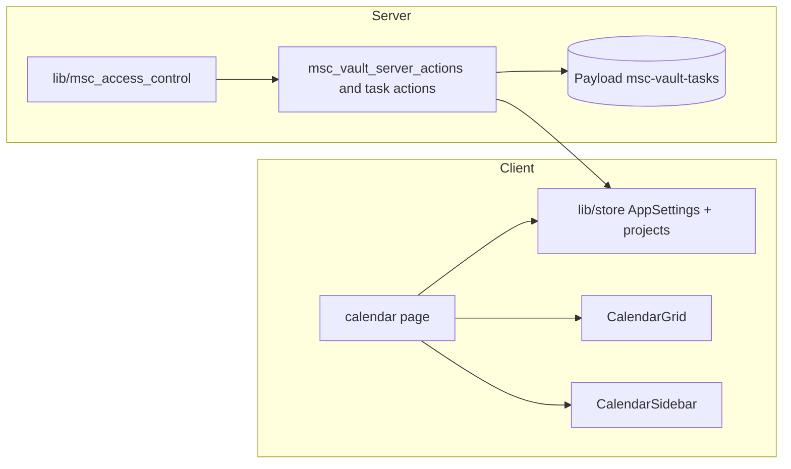

# Sprint 5: Collaborative Task & Timeline Foundation (Calendar + PAC)

## Reality check (repo)

- **Tasks already exist** as Payload collection **`msc-vault-tasks`** in [`collections/MSC-Projectz-VaultTasks.ts`](collections/MSC-Projectz-VaultTasks.ts) (fields: `title`, `status`, `completed`, `archived`, `project` → `msc-vault-projects`, `assignedTo` → `users`). Access control is in [`lib/msc_vault_payload_access.ts`](lib/msc_vault_payload_access.ts) (`msc_vaultReadOwnTasks` resolves visible projects, then `project in ids`).
- **Client `Task` type** is in [`lib/types.ts`](lib/types.ts) (no `dueDate` / `description` / `priority` yet). Mapping lives in [`lib/msc_map_vault.ts`](lib/msc_map_vault.ts) (`msc_mapTaskDoc`).
- **Global tasks UI** is [`components/global-tasks-view.tsx`](components/global-tasks-view.tsx) on route [`app/(main)/(command-center)/tasks/page.tsx`](app/(main)/(command-center)/tasks/page.tsx). Sidebar nav is [`components/dashboard-sidebar.tsx`](components/dashboard-sidebar.tsx) (`/dashboard`, `/tasks`, …) — there is **no** `app/(dashboard)/...` group; the calendar page should live under **`app/(main)/(command-center)/calendar/page.tsx`** and reuse the same Command Center layout.
- **Reference visuals**: [`_design_references/Calendar/`](_design_references/Calendar/) and [`_design_references/Tasks/`](_design_references/Tasks/) (plus the bundled `MSC-Projectz-v0` snapshot). Use as density/spacing/schedule + grid inspiration; implementation stays **shadcn + raw CSS Grid + date-fns** (no FullCalendar).
- **Sprint 4 safety**: Do not modify [`lib/msc_project_sort.ts`](lib/msc_project_sort.ts), project manual move, or `manualRank` wiring. Calendar reads the same `projects` / task data; no reorder APIs.

## Architecture (high level)



- **PAC** is the single place to answer "can this `userId` read/edit this task or project?" using the same rules as `msc_vaultReadOwnTasks` / project visibility, so any **local API** path that uses `overrideAccess` must call PAC **before** returning or mutating data. Payload's own `access` on collections remains the first line of defense; PAC is for **defense in depth and UI-facing server actions**.

---

## Step 1 — PAC service (stop and verify with you)

**Goal:** New module [`lib/msc_access_control.ts`](lib/msc_access_control.ts) (server-only; `import 'server-only'` or only imported from server actions) with:

- `msc_canViewProject({ payload, userId, projectId }): Promise<boolean>` — true if user is admin/master-admin **or** project is visible per existing `msc_vaultProjectVisibilityWhere` semantics (owner or `members`).
- `msc_canViewTask({ payload, userId, taskId }): Promise<boolean>` — resolve task's `project`, then delegate to `msc_canViewProject` (or equivalent to current `msc_vaultReadOwnTasks` `project in` logic).
- `msc_canEditTask({ payload, userId, taskId }): Promise<boolean>` — stricter: align with who may **update** a task (today: same read set for non-admins in access file; if product later restricts edits to owner-only, this is the one place to tighten).

**Implementation notes:**

- Reuse [`msc_vaultLocalApiContext`](lib/msc_vault_server_actions.ts) (or the same `getPayload` + user pattern) **inside** existing task/project server actions, not in client components.
- Add thin wrappers that accept **numeric/string `userId`** and Payload document ids (same coercion helpers as in [`lib/msc_vault_server_actions.ts`](lib/msc_vault_server_actions.ts)).
- **Refactor minimally:** introduce PAC at the start of the **task- and project-touching** server actions you rely on for calendar and global tasks (load, update, create where `overrideAccess` is used), without changing external signatures.

**Step 1 verification (you):** Run `npm run verify:next`; spot-check that existing `/tasks` and dashboard still work; no UI change yet.

---

## Step 2 — Task schema + DB + types (stop and verify)

**Goal:** Extend **existing** `msc-vault-tasks` (do **not** create a second tasks collection or duplicate file name `MSC-Projectz-Tasks` as a full replacement).

**Recommended fields to add in [`collections/MSC-Projectz-VaultTasks.ts`](collections/MSC-Projectz-VaultTasks.ts):**

| Field | Type | Notes |
|--------|------|--------|
| `description` | `richText` (Lexical) **or** `textarea` for speed | Your call in implementation; `textarea` is smaller scope. |
| `dueDate` | `date` (optional) | Drives calendar placement; `null` = unscheduled. |
| `priority` | `select` e.g. `low` / `normal` / `high` (defaults) | Enums in Payload, mirror in `lib/types` |

**Status display (locked — no DB migration for status):**

- **Do not** rename `todo` / `in-progress` / `done` in the database. [`components/global-tasks-view.tsx`](components/global-tasks-view.tsx), server actions, and any `TaskStatus` unions would all need error-prone churn.
- Add a small **label map** used by Calendar + Schedule only (and optionally shared later), e.g. in [`lib/msc_map_vault.ts`](lib/msc_map_vault.ts) or a dedicated `lib/msc_task_status_labels.ts` re-exported from the map file:

```ts
const TASK_STATUS_LABELS: Record<TaskStatus, string> = {
  todo: 'Backlog',
  'in-progress': 'Active',
  done: 'Complete',
}
// plus msc_getTaskStatusLabel(status: TaskStatus) helper
```

- Keep **Payload and store** with the existing string keys; only the **UI string** changes for Untitled / Soft Studio copy.

**Follow-through:**

- Extend [`lib/types.ts`](lib/types.ts) `Task` (+ optional `TaskStatus` or separate display type).
- Extend [`lib/msc_map_vault.ts`](lib/msc_map_vault.ts) and any task create/update in [`lib/msc_vault_server_actions.ts`](lib/msc_vault_server_actions.ts) / store.
- **SQLite:** Extend [`scripts/msc_sqlite_repair_vault_schema.mjs`](scripts/msc_sqlite_repair_vault_schema.mjs) for new physical columns (Payload 3 + SQLite naming may use snake_case) — run `npm run repair:sqlite` on dev.
- **Register** collection changes in [`payload.config.ts`](payload.config.ts) if already centralized (no duplicate registration).

**Step 2 verification (you):** `npm run verify:next`, `npm run repair:sqlite`, create a task in admin with `dueDate` and see it in API/store mapping.

**manualRank:** No code paths in this step should reference project `manualRank` except read-only if needed; do not change dashboard sort.

---

## Step 3 — Calendar UI (Grid + Schedule sidebar + drawer)

**Goal:** "Untitled UI"-like **schedule + grid** in Soft Studio, **no heavy third-party calendar**.

**State ([`lib/types.ts`](lib/types.ts) + [`lib/store.ts`](lib/store.ts) + `defaultAppSettings` / persist merge):**

- `calendarView: 'day' | 'week' | 'month'`
- `selectedDate: string` (ISO date) or store as `Date` in memory with ISO in persist (prefer **ISO string** in persisted JSON for safety).

**New components (names can stay as you specified):**

- [`components/CalendarGrid.tsx`](components/CalendarGrid.tsx) — `display: grid;` + `date-fns`. **Critical:** do **not** run `eachDayOfInterval` (or equivalent) in the main render body. Compute the current view’s `Date[]` in **`useMemo`** keyed by `calendarView` and `selectedDate` (and derive week start / month start inside that memo). The grid is visually **read-only** for v1: cells show chips; heavy interaction lives in the sidebar + sheet.
- [`components/CalendarTaskChip.tsx`](components/CalendarTaskChip.tsx) (or inline export from grid file) — wrap in **`React.memo`**. Pass **minimal props** (task id, title, project label, `dueDate` slice, `isSelected`, `onSelect`). Avoid passing unstable inline objects. Chips are the **primary** re-render hot spot; validate with React DevTools "Highlight updates" if needed.
- [`components/CalendarSidebar.tsx`](components/CalendarSidebar.tsx) — **Agenda** for the selected day: interactive list (open sheet, mark done, etc.). **Split** from the grid on purpose: grid stays simple; sidebar holds richer state and actions—this **reduces** calendar page complexity.
- Optional: [`components/CalendarTaskSheet.tsx`](components/CalendarTaskSheet.tsx) (or inline) using existing [`components/ui/sheet.tsx`](components/ui/sheet.tsx) for slide-over **task detail**; wire to `msc_canEditTask` for enable/disable of fields.

**Route and layout:**

- [`app/(main)/(command-center)/calendar/page.tsx`](app/(main)/(command-center)/calendar/page.tsx) — two-column layout: main = **Grid**, right = **Sidebar** (on small screens: stack or `Sheet` for sidebar per reference); respect mobile drawer patterns from existing shell.
- **Nav:** add `{ path: '/calendar', label: 'Calendar', icon: Calendar }` in [`components/dashboard-sidebar.tsx`](components/dashboard-sidebar.tsx) and any header/breadcrumb in [`components/dashboard-layout.tsx`](components/dashboard-layout.tsx) if needed.

**Data for v1 — two acceptable paths:**

- **A (MVP):** Client: flatten `useAppStore` `projects[].tasks` and filter by `dueDate` in the **visible** range (same range as `useMemo` for the grid, so you don’t filter the world on every paint—compute `rangeStart` / `rangeEnd` once in memo, then `useMemo` a list of “tasks in window”).
- **B (scale):** Server action **`msc_loadTasksForDateRange({ start, end })`** (PAC-guarded) with a **default window** of about **6 weeks** centered on the current calendar context (e.g. visible month plus partial weeks / bleed-over into adjacent months) so the first load stays **bounded**. When the user navigates months, fetch or extend the window; avoid unbounded "all tasks" queries. Exact bounds can be `startOfWeek(startOfMonth(anchor))` through `endOfWeek(endOfMonth(anchor))` or a fixed 42-day month grid—pick one formula and document it in the action.

**Task creation (v1 recommendation):** Use an explicit **“Add task”** control (button or header action) that opens a **modal or sheet** with title, project, and **date** (default to `selectedDate`). **Do not** rely on “click empty cell → create” for the first shippable slice: fewer mis-clicks and less coordinate/cell state. **Optional later:** add empty-cell create once the base flow is stable.

**Performance (summary):**

- Date arrays: only inside **`useMemo`**, keys `calendarView` + `selectedDate` (and time zone if you add one).
- **Task chip:** `React.memo` + narrow props; parent uses **`useCallback`** for select handlers if passed down.
- Sidebar rows: `memo` list items where helpful; avoid passing whole `Project` objects if a `projectName` string suffices.

**Step 3 verification (you):** Visual pass vs `_design_references`; `npm run verify:next`; smoke `/calendar`, open drawer, no regressions on `/tasks` and `/dashboard` sort.

---

## Docs to touch (light)

- Update [`/.cursor/docs/Development-Roadmap.md`](.cursor/docs/Development-Roadmap.md) Sprint 5 checkbox and short note.
- Add a line to [`Session-Snapshots.md`](.cursor/docs/Session-Snapshots.md) at closeout of Step 3.

---

## Locked decisions (review 2026-04-27)

- **Status keys:** **Label map only** — no database migration; use `TASK_STATUS_LABELS` / helper next to or inside [`lib/msc_map_vault.ts`](lib/msc_map_vault.ts) (or tiny dedicated module) for Calendar + Schedule.
- **Grid performance:** `eachDayOfInterval` (or equivalent) **only** in `useMemo`, not the render body.
- **Chips:** dedicated **`TaskChip` + `React.memo`**, stable props, selection handled without remounting the whole grid.
- **Layout / state:** keep **grid simple**, **sidebar** for interactive agenda; aligns with the reference and keeps state tractable.
- **Create flow (v1):** **Add task** + modal/sheet with explicit date; empty-cell create is **out of scope** for first delivery unless you later promote it.
- **Server date range (when you add `msc_loadTasksForDateRange`):** default to a **~6-week bounded window** (or month grid bounds) to protect load time, not an unbounded full history pull.

## Extra recommendations (implementation)

- **Time zone:** store/compare `dueDate` in **UTC date-only** or “local date at noon” consistently so `date-fns` boundaries don’t off-by-one across DST; document the convention in the Step 2 types.
- **Empty states:** one shared empty string for "no due date" tasks if you show an “Unscheduled” bucket later—optional.
- **Accessibility:** ensure grid has **keyboard** navigation and **aria** labels for day cells and chips (calendar patterns are easy to get wrong for screen readers—at least don’t use `div` click-only for primary actions without roles).
